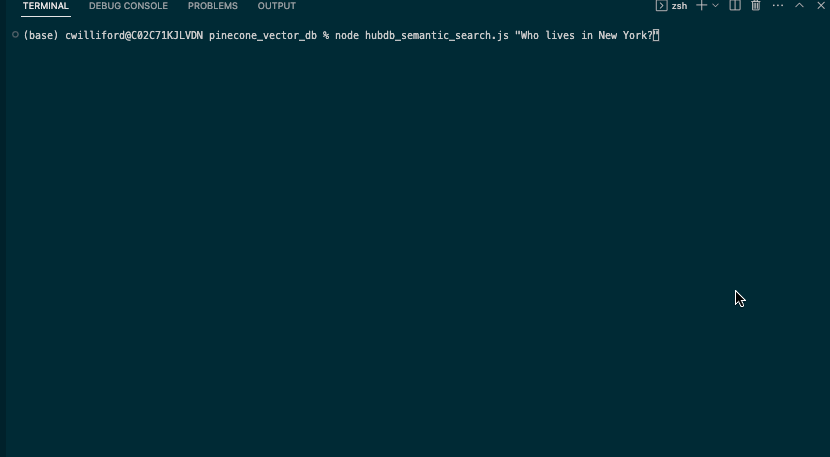
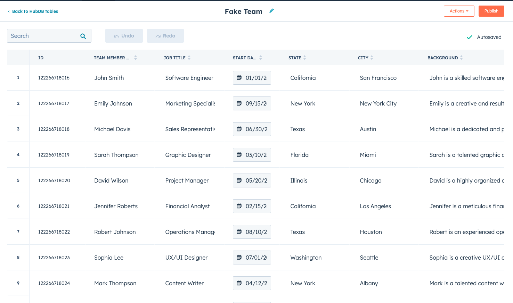

# HubDB Semantic Search
This is a command line tool (UI pending) for semantic search on a HubDB table. This could offer useful search on a team members CMS page.

  

## How it works:

I asked ChatGPT to create a csv of 40 employees I imported to a HubDB table:

  

The script `hubdb_to_pinecone.js` fetches the table rows, uses OpenAI's embeddings API to store create embeddings from them, then upserts them into a Pinecone index. My HubDB Data is now stored as vectors in my Pinecone index.

The script `hubdb_semantic_search.js` takes a user input, uses OpenAI's embeddings API to create an embedding from it, queries the Pinecone index to get the 10 most closely related vectors, then passes the vectors as context into a prompt to OpenAI's chat completions API using the model gpt-3.5-turbo and logs the response.
